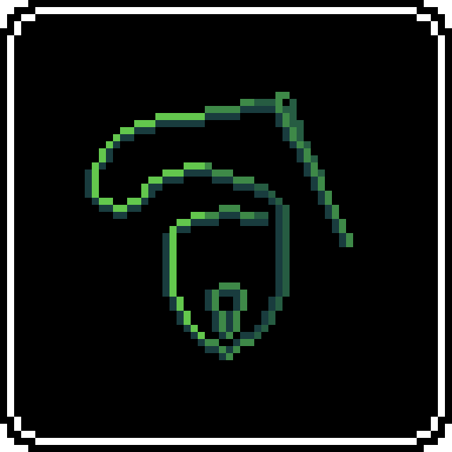
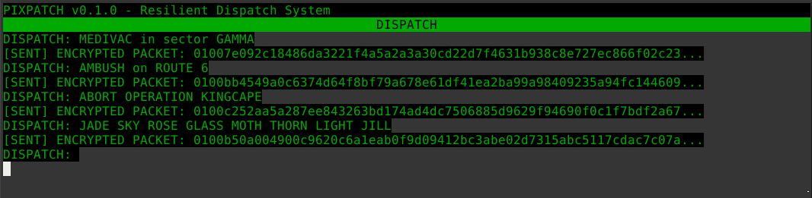
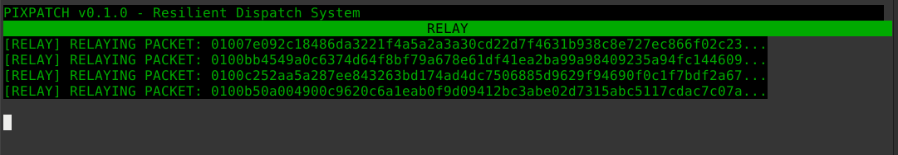
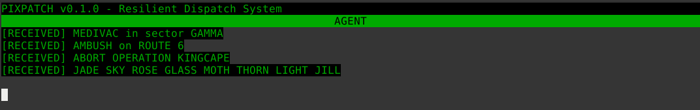

<div align="center">
    
    <h1>PIXPATCH</h1>
</div>

**A resilient, end-to-end encrypted dispatch system for hostile network environments.**

*Built for the HackYeah 2025 - Defence.*

---

### The Problem

In conflict zones or disaster areas, traditional communication infrastructure is often the first thing to fail. Centralized systems like cell towers and internet exchanges are vulnerable targets, making it impossible for aid workers, journalists, and civilians to communicate securely. Existing decentralized solutions often lack the robust security or versatility needed when messages contain life-or-death information.

### Our Solution: Pixpatch

Pixpatch is a proof-of-concept terminal application that demonstrates a new paradigm for secure communication. It is a dispatch system built on top of **[EFPIX](https://github.com/shinymonitor/libefpix)**, a zero-trust, encrypted flood protocol.

This approach provides:
*   **Resilience:** Messages are flooded through all available nodes, finding a path around failures.
*   **Security:** State-of-the-art end-to-end encryption (X25519, ChaCha20-Poly1305) ensures only the recipient can read messages.
*   **Anonymity:** The protocol is designed to protect the metadata of who is talking to whom.
*   **Serverless:** It requires no central server, making it impossible to shut down.

### Demo

Pixpatch simulates a 3-node network (a Dispatcher, an untrusted Relay, and a Field Agent) in a single terminal window to visualize the protocol's security.



Type the dispatch message and enter to send



See the relayed packets



Decodes and reads the messages

### Key bindings
ARROW LEFT/RIGHT : Switch between node types
CTRL+Q : Quit

### How to Build and Run

The project is built with a simple Makefile. It depends on the open-source `libefpix` library, which in turn depends on `monocypher`.

**POSIX compliant OS required (Linux recommended)**

```bash
# Clone the repository
git clone https://github.com/shinymonitor/pixpatch.git
cd pixpatch

# Build the application
make

# Run the demo
./build/pixpatch